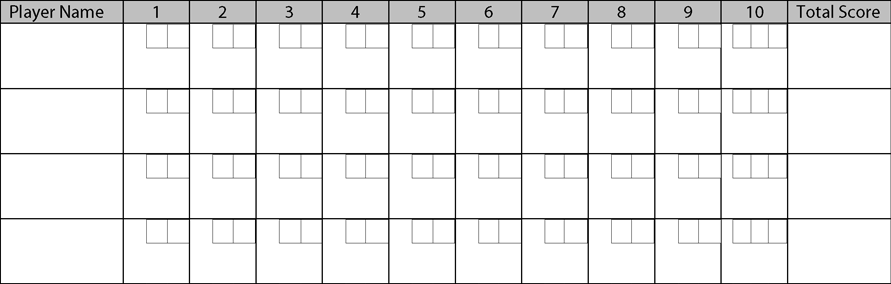

# UI Codetest - Bowling Scoresheet

__Objective__

Create an application to track the score of a bowling game.

__Directions__

Fork this repository and create a branch for your answer submission. You may provide a link to the branch or create a pull request to this repo with your answer.

__Example Scoresheet__

## Requirements
- Include 4 players in the game
- Score should be entered via a form in a modal:
  - The form has a submit and cancel button
  - clicking anywhere outside the modal will close the modal
  - The form can calculate the total and apply any validation and scoring rules
  - When the answer is submitted correctly, the modal should close and the information in the scoresheet should update
- Follow standard bowling score rules:
  - Points are from 0-10
  - X = strike
  - / = spare

## Restrictions

  - __CSS:__  Only normalize.css allowed, no additional css frameworks are permitted. Normalize.css is included in the provided template.
  - __JavaScript:__  VanillaJS, jQuery, or Angular Core only(or similar framework - react, backbone, etc) . No extra widget libraries
  - __HTML:__  Semantic, well-formed, and accessible HTML preferred

## Bowling Scoring Rules

[Ten-Pin bowling on Wikipedia](https://en.wikipedia.org/wiki/Ten-pin_bowling)

Every frame the player makes at least one roll.

If they knock down 10 pins they have a strike (marked with an X) and don't roll anymore in this frame, otherwise they roll once more. If that second roll knocks down the remaining pins, then they have a spare (marked with a /).

The score of a frame is the sum of their rolls. If they rolled a strike, the next 2 rolls are added to their score(whether they are 2 in the next frame, or in the case of 3 strikes in a row, the next 2 frames). In the case of a spare
they add the next roll to their score.

The final frame has some special handling. If they player rolls a strike, they roll twice more (but those don't have any special strike handling, they're just added to the total). If the player rolls a spare, they roll once more.

A perfect game (all strikes, and knocking down 10 pins in all rolls on the last frame) is 300 points.
